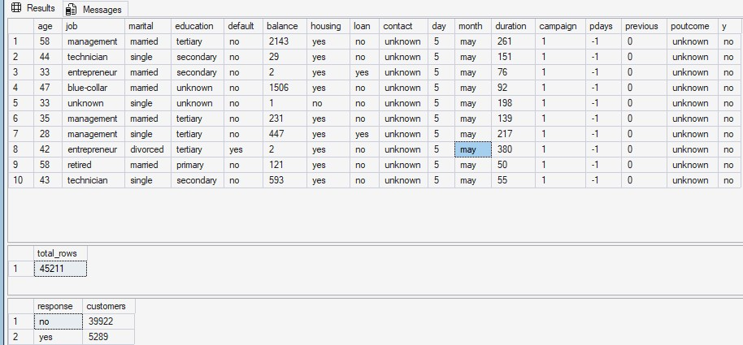
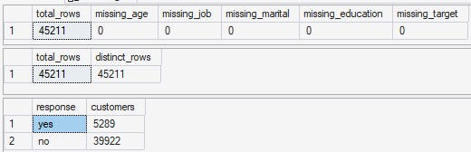
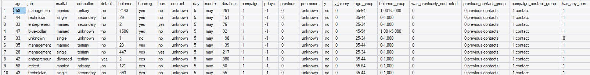
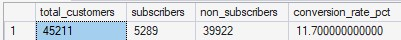
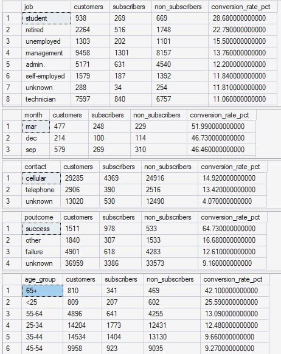
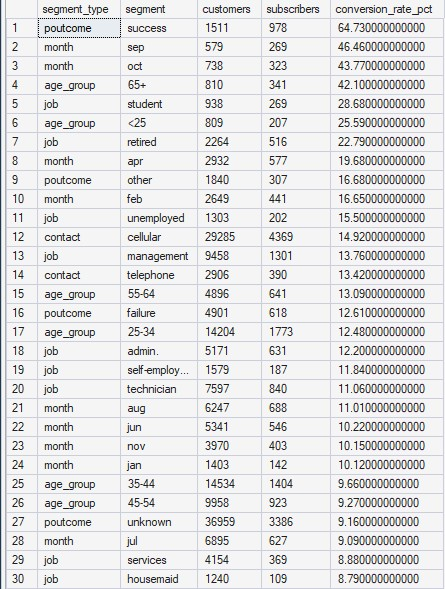
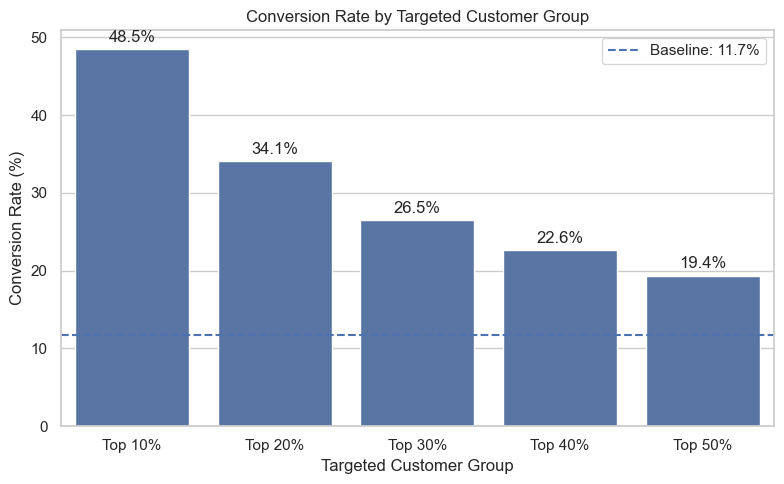
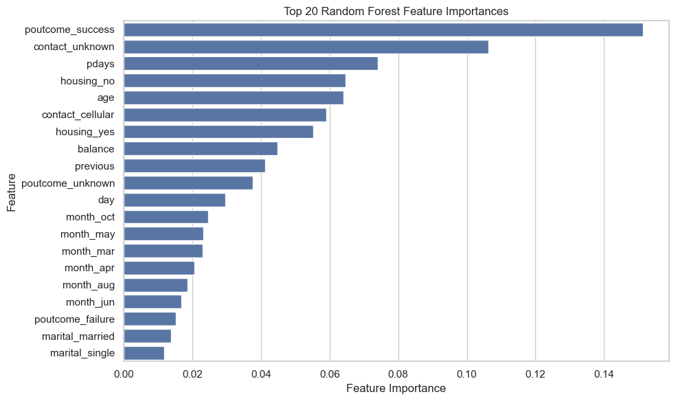
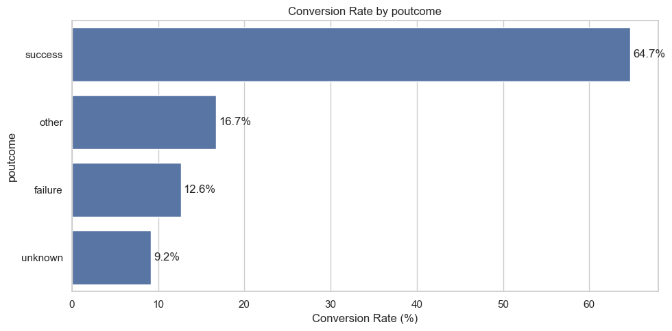

# Bank Marketing Campaign Analysis

## Project Overview

This project analyzes a bank marketing campaign dataset to understand customer subscription behavior and improve campaign targeting.

The dataset contains customer demographic information, financial attributes, contact history, campaign details, and whether each customer subscribed to a term deposit.

This project focuses on SQL-based data preparation and Python-based campaign response analysis.

Included in this project:

- SQL Server data import, validation, KPI calculation, and reusable views
- Python exploratory analysis, predictive modeling, targeting lift evaluation, and model interpretation
- GitHub documentation and project organization

## Business Objective

The main business goal is to identify which customers are more likely to subscribe to a term deposit so that the bank can improve campaign targeting and reduce inefficient outreach.

Key questions:

- What is the overall campaign conversion rate?
- Which customer and campaign segments have higher response rates?
- Can predictive modeling improve customer targeting?
- Which features are most useful for identifying likely subscribers?
- How can the results be translated into business recommendations?

## Tools Used

- SQL Server: data import, validation, KPI calculation, analysis-ready views, and segment summaries
- Python: SQL handoff review, EDA visualization, predictive modeling, targeting lift analysis, and model interpretation
- GitHub: project documentation and version control

## Project Workflow

1. Import and validate the raw dataset using SQL Server.
2. Create SQL views for analysis-ready data, campaign KPIs, and segment conversion summaries.
3. Load SQL views into Python.
4. Visualize segment-level conversion patterns in Python.
5. Build and compare baseline predictive models.
6. Evaluate campaign targeting lift using model-predicted probabilities.
7. Interpret Random Forest feature importance.
8. Translate insights into business recommendations.


## How to Run

1. Run `sql/00_setup_import.sql` in SQL Server to create the database, create the raw table, import the CSV file, and check the import.
2. Run `sql/01_bank_marketing_analysis.sql` to validate the imported data and create the analysis-ready views.
3. Open `notebook/bank_marketing_campaign_python_analysis.ipynb`.
4. Update the SQL Server connection string in the notebook if your SQL Server instance name is different.
5. Run the notebook from top to bottom.

---

## SQL Analysis

SQL Server was used to prepare the database layer and produce reusable analysis outputs for the project.

The SQL work focuses on:

- creating the project database and raw data table
- importing the original CSV file
- validating row counts, target values, and data quality
- creating business-friendly fields for analysis
- calculating campaign KPIs
- summarizing conversion rates by customer and campaign segments
- creating reusable SQL views for Python analysis

### SQL Files

The SQL scripts are stored in the `sql/` folder:

- `00_setup_import.sql`: creates the database, creates the raw table, imports the CSV file, and checks whether the import worked correctly.
- `01_bank_marketing_analysis.sql`: validates the imported data, creates analysis-ready views, calculates campaign KPIs, and performs segment conversion analysis.

### Key SQL Views

The SQL analysis creates the following views:

- `vw_bank_marketing_analysis_ready`
- `vw_campaign_kpi`
- `vw_segment_conversion_summary`

These views support SQL analysis and provide the handoff into the Python notebook.

### Main SQL Outputs

The SQL analysis produces:

- overall campaign conversion KPI
- data quality validation checks
- analysis-ready view with business-friendly fields
- conversion rate by job, month, contact type, previous campaign outcome, and age group
- high-response segment summary

### SQL Output Screenshots

**Raw Table Check**



**Data Quality Check**



**Analysis-Ready View**



**Overall Campaign KPI**



**Segment Conversion Analysis**



**High-Response Segment Summary**



### SQL Summary

The SQL analysis confirms that the dataset was imported correctly and that the campaign baseline conversion rate is approximately **11.7%**.

The SQL segment summaries show meaningful differences in conversion rates across customer and campaign groups. These outputs provide a reliable handoff into Python analysis.

---

## Python Analysis

The Python notebook continues from the SQL workflow instead of restarting from the raw CSV.

Notebook file:

- `notebook/bank_marketing_campaign_python_analysis.ipynb`

The notebook connects to SQL Server and loads:

- `vw_bank_marketing_analysis_ready`
- `vw_campaign_kpi`
- `vw_segment_conversion_summary`

### Python Notebook Workflow

The Python notebook includes:

- SQL-to-Python handoff validation
- review of SQL KPI and segment summary outputs
- visualization of SQL-created segment conversion summaries
- high-response segment analysis
- Cramer's V statistical association check
- data preparation for predictive modeling
- baseline model comparison
- campaign targeting lift evaluation
- Random Forest feature importance
- business recommendations and limitations

### Python Output Screenshots

**Campaign Targeting Lift**



**Feature Importance**



**Segment Conversion Patterns**




### Python Data Preparation

The main modeling dataset comes from the SQL analysis-ready view.

The model uses original customer and campaign fields only:

- `age`
- `job`
- `marital`
- `education`
- `default`
- `balance`
- `housing`
- `loan`
- `contact`
- `day`
- `month`
- `pdays`
- `previous`
- `poutcome`

The model excludes:

- `duration`, because it is only known after the customer is contacted
- `campaign`, because it reflects current-campaign contact count and is less appropriate for a pure pre-campaign targeting model

This supports a pre-campaign targeting use case where the bank ranks customers before deciding whom to contact.

---

## Key Findings

### Baseline Campaign Conversion

The overall campaign conversion rate is approximately **11.7%**.

This means only about 12 out of every 100 contacted customers subscribed to the term deposit, so random outreach is inefficient.

### High-Response Segments

The strongest high-response segments include:

| Segment Type | Segment | Customers | Subscribers | Conversion Rate |
|---|---:|---:|---:|---:|
| Previous campaign outcome | success | 1,511 | 978 | 64.73% |
| Month | September | 579 | 269 | 46.46% |
| Month | October | 738 | 323 | 43.77% |
| Age group | 65+ | 810 | 341 | 42.10% |
| Job | student | 938 | 269 | 28.68% |

These segments suggest that previous campaign success, campaign timing, age profile, and job profile are useful signals for identifying customers with higher response likelihood.

### Statistical Association

Cramer's V analysis shows that the strongest categorical associations with subscription outcome are:

| Feature | Cramer's V |
|---|---:|
| `poutcome` | 0.312 |
| `month` | 0.260 |
| `previous_contact_group` | 0.171 |
| `was_previously_contacted` | 0.167 |
| `has_any_loan` | 0.159 |
| `contact` | 0.151 |
| `age_group` | 0.149 |

This supports the EDA finding that campaign history, campaign timing, and contact context are more informative than demographic variables alone.

---

## Predictive Modeling

Three baseline models were compared:

- Logistic Regression
- Decision Tree
- Random Forest

### Model Comparison

| Model | Accuracy | Precision | Recall | F1-score | ROC-AUC |
|---|---:|---:|---:|---:|---:|
| Random Forest | 0.794 | 0.309 | 0.620 | 0.413 | 0.788 |
| Logistic Regression | 0.757 | 0.268 | 0.620 | 0.374 | 0.769 |
| Decision Tree | 0.758 | 0.263 | 0.593 | 0.364 | 0.740 |

Random Forest performed best overall, especially by ROC-AUC and F1-score.

Because the target is imbalanced, accuracy alone is not enough. ROC-AUC, recall, precision, and lift are more useful for evaluating whether the model can prioritize likely subscribers.

---

## Campaign Targeting Lift

The Random Forest model was selected for targeting evaluation.

Using predicted subscription probabilities, the model ranks customers from most likely to least likely to subscribe.

| Targeted Group | Customers Targeted | Subscribers Captured | Conversion Rate | Capture Rate | Lift vs Baseline |
|---|---:|---:|---:|---:|---:|
| Top 10% | 904 | 438 | 48.45% | 41.40% | 4.14x |
| Top 20% | 1,808 | 617 | 34.13% | 58.32% | 2.92x |
| Top 30% | 2,712 | 718 | 26.47% | 67.86% | 2.26x |
| Top 40% | 3,617 | 818 | 22.62% | 77.32% | 1.93x |
| Top 50% | 4,521 | 875 | 19.35% | 82.70% | 1.65x |

The top 10% highest-probability customers achieved a conversion rate of **48.45%**, compared with the baseline conversion rate of **11.7%**.

This represents a lift of approximately **4.14 times** the baseline.

---

## Model Interpretation

Random Forest feature importance was reviewed at both the encoded feature level and the original variable level.

### Top Encoded Features

Important encoded or processed features include:

- `poutcome_success`
- `contact_unknown`
- `pdays`
- `housing_no`
- `age`
- `contact_cellular`
- `housing_yes`
- `balance`
- `previous`

### Feature Importance by Original Variable

| Original Feature | Importance |
|---|---:|
| `poutcome` | 0.209 |
| `contact` | 0.171 |
| `month` | 0.158 |
| `housing` | 0.120 |
| `pdays` | 0.074 |
| `age` | 0.064 |
| `balance` | 0.045 |
| `previous` | 0.041 |

The strongest predictors are mainly campaign-related variables, especially previous campaign outcome, contact channel, and campaign timing.

Feature importance shows which variables helped the model make better predictions. It should be interpreted as predictive usefulness, not proof that a variable directly causes customers to subscribe.

---

## Business Recommendations

Based on the segment analysis, predictive modeling, targeting lift evaluation, and model interpretation, the bank should use probability-based targeting instead of random customer selection.

Recommended actions:

- Use the Random Forest model to rank customers by predicted subscription probability.
- Prioritize the highest-probability customers when campaign capacity is limited.
- Use the top 10% group when the goal is maximum efficiency and strongest lift.
- Use the top 20% or 30% groups when the bank wants broader campaign reach while still maintaining above-baseline conversion.
- Compare all targeted groups against the baseline conversion rate of approximately 11.7%.
- Combine customer profile information with campaign context and previous campaign behavior.
- Use the model as a ranking tool, not only as a fixed yes/no classifier.

---

## Limitations and Future Improvements

Limitations:

- The dataset does not include a unique customer identifier, so the analysis treats each row as an independent campaign contact record.
- The dataset includes `month` and `day`, but not a full date or year, so the project does not support a true time-series analysis.
- The model was trained on historical campaign data, so future campaign performance should be monitored.
- Feature importance shows predictive usefulness, not causal impact.
- Business constraints such as call cost, campaign capacity, and contact limits are not included yet.
- The model uses a single train-test split; future work could use cross-validation.
- Financial impact modeling is not included yet.

Future improvements:

- Use cross-validation for more robust model evaluation.
- Test different probability thresholds based on campaign capacity.
- Add financial impact analysis using campaign cost, contact capacity, and expected conversion value.
- Build a separate Power BI-focused project to demonstrate dashboard design and reporting skills.

---

## Repository Structure

```text
bank-marketing-campaign-analysis/
│
├── README.md
├── .gitignore
│
├── notebook/
│   └── bank_marketing_campaign_python_analysis.ipynb
│
├── sql/
│   ├── 00_setup_import.sql
│   └── 01_bank_marketing_analysis.sql
│
├── data/
│   └── README.md
│
└── images/
    ├── sql/
    │   ├── raw_table_check.jpg
    │   ├── data_quality_check.jpg
    │   ├── create_analysis_ready_view.jpg
    │   ├── overall_campaign_kpi.jpg
    │   ├── conversion_by_segment.jpg
    │   └── high_response_segment_summary.jpg
    │
    └── python/
        ├── targeting_lift.png
        ├── feature_importance.png
        └── segment_conversion_patterns.png
```
